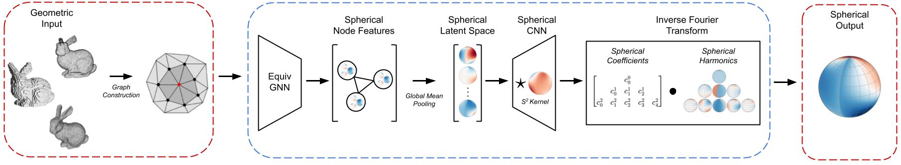

# Geometry2Sphere

## Overview

Geometry2Sphere (G2S) is a $SO(3)$-equivariant model designed to map 3D geometric inputs to continuous spherical signals. G2S operates entirely in Fourier space, encoding geometric structure into latent Fourier features using equivariant neural networks and then outputting the Fourier coefficients of the output signal. Combining these coefficients with spherical harmonics enables the simultaneous prediction of all values of the continuous spherical signal at any resolution.

<kbd></kbd>

### Experiments
Many modeling tasks take an object mesh as input and predict a physical property of that object. If the property depends on a direction vector, that is, a spherical coordinate $(\theta, \phi)$, then the output may be represented as a continuous function defined on the 2-sphere. This reposiory focuses on evaluating the performance of G2S on two supervised learning tasks, predicting radar response and aerodynamic drag. For use of a G2S model on policy learning see [Fourier Value Functions](https://github.com/ColinKohler/fourier_value_functions).

## Install
1. Install [EquiHarmony](https://github.com/ColinKohler/EquiHarmony)
2. Clone this repository
```
git clone git@github.com:ColinKohler/geometry2sphere.git
```
3. Install dependencies from Pipfile
```
pip install -r requirments.txt
```
4. Download datasets
```

```

## Running G2S
```
python scripts/train.py --config-name=g2s_basic_asym.yaml
```
Additional config files can be found in `geometry2sphere/config`.

## Cite

## Disclaimer

DISTRIBUTION STATEMENT A. Approved for public release. Distribution is unlimited.
This material is based upon work supported by the Under Secretary of Defense for Research and Engineering under Air Force Contract No. FA8702-15-D-0001. Any opinions, findings, conclusions or recommendations expressed in this material are those of the author(s) and do not necessarily reflect the views of the Under Secretary of Defense for Research and Engineering. © 2024 Massachusetts Institute of Technology. The software/firmware is provided to you on an As-Is basis. Delivered to the U.S. Government with Unlimited Rights, as defined in DFARS Part 252.227-7013 or 7014 (Feb 2014). Notwithstanding any copyright notice, U.S. Government rights in this work are defined by DFARS 252.227-7013 or DFARS 252.227-7014 as detailed above. Use of this work other than as specifically authorized by the U.S. Government may violate any copyrights that exist in this work.
